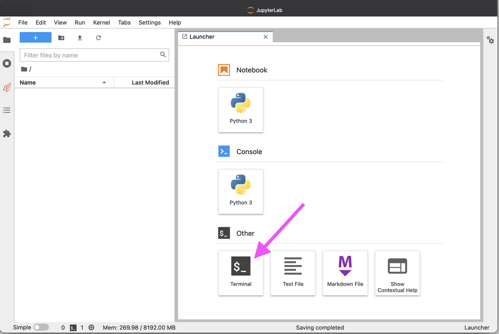
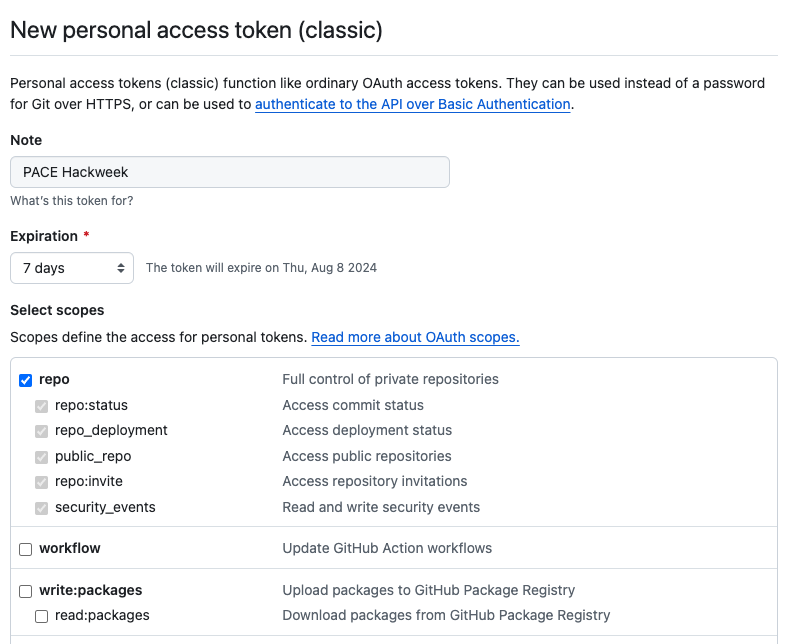

# Setting up Git

## What is Git?

[Git](https://git-scm.com/) is a version control system that many scientists use
to collaborate on code.

```{note}
You are not required to know Git in advance of this event, but this is a great opportunity to learn all about it!
[Here's a quick introduction video from the official website](https://git-scm.com/video/what-is-git)
```

## Setting up on JupyterHub

Below are instructions to get you setup with Git on the {{ hackweek }} container image
running on CryoCloud. These are only basic instructions to get started. See the
[Software Carpentry Git](https://swcarpentry.github.io/git-novice/index.html)
instructions for a thorough explanation and background information.

### 1. Login to JupyterHub

Go to {{ jupyterhub_url }}.

### 2. Open a Terminal

Choose the "**Terminal**" app from the "Other" options in the Launcher.



### 3. Configure Basic Information

Set your name and email address. The `user.name` is your full name, not your "username"
on GitHub or anywhere else. The email address should be one registered on your GitHub account.

```{attention}
Use your own name instead of the placeholder `Attendee Name`
in the below commands. For the email, it should be an address you use with
your GitHub account instead of `attendee@example.com`. Both values need to be
surrounded by quotes `"`.
```

```shell
$ git config --global user.name "Attendee Name"
$ git config --global user.email "attendee@example.com"
$ git config --global pull.rebase false
```

The third line configures the strategy git will apply to changes you pull from a remote git repository.
More on strategies is [described here.](http://git-scm.com/book/en/v2/Git-Branching-Rebasing)

To verify that you successfully executed the above commands, use the `git config --list` command
in the Terminal. The output should look similar to this:
```shell
$ git config --list
user.name=Attendee Name
user.email=attendee@example.com
pull.rebase=false
```

### 4. Authenticating with GitHub

In order to interact with GitHub via the `git` command in the Terminal or the Git panel in JupyterLab,
you need to set up authentication. We describe three methods below. The first two rely on
Personal Access Tokens (PATs), which you can learn about in the [GitHub PAT docs][gh-pat].
The difference between these first two is whether you create your own PAT or use a GitHub App to manage PATs.
The third method uses SSH key pairs, which you can learn a lot about in the [GitHub SSH docs][gh-ssh]. 

[gh-ssh]: https://docs.github.com/en/authentication/connecting-to-github-with-ssh
[gh-pat]: https://docs.github.com/en/authentication/keeping-your-account-and-data-secure/managing-your-personal-access-tokens

#### Option 1: Manual PAT Configuration

Open up the instructions on the
[GitHub personal access tokens](https://docs.github.com/en/authentication/keeping-your-account-and-data-secure/managing-your-personal-access-tokens#creating-a-personal-access-token-classic)
page.
When you've gotten through it all, GitHub will have created a token, but you have to save it before navigating away. Treat it like you would any password, and know that the token won't be visible again!

For this hackweek, check the full repo scope as shown in this screenshot:



To use the PAT, you need Git to do something that requires authentication, such as pushing to a repository or cloning a private repository.
These actions will prompt for credentials.
**Use a PAT instead of your GitHub password**.

```{attention}
The Terminal prompt for the `Password:` will not show any characters that are entered
and stay blank. Make sure to only paste in your token once and then hit the enter key.
```

#### Option 2: GitHub Scoped Credentials

We recommend this method if you have permission to configure a GitHub App on the user or organization where you
need to authenticate. For instance, if you want to push to `https://github.com/example/repo.git`, then you need to have
permission to configure the settings for `example` (a user or organization).

Start from a Terminal (choose the "Terminal" app from the "Other" options in the Launcher). Follow
the instructions returned by the `gh-scoped-creds` command:

```shell
$ gh-scoped-creds 
You have 15 minutes to go to https://github.com/login/device and enter the code: XXXX-XXXX
Waiting......
```

After you have entered the code and granted authorization, the Terminal will update:

```shell
Success! Authentication will expire in 8.0 hours.

Visit https://github.com/apps/cryocloud-github-access to manage list of repositories you can push to from this location
Tip: Use https:// URLs to clone and push to repos, not ssh URLs!
```

To set up the user or oranization to allow access by the Personal Access Token just created, follow the link provided.

Here is a GIF walking through the workflow. Note that it shows a way to do the same setup in a notebook before
showing the Terminal way just described.


#### Option 3: SSH Key Pair

This method relies on a private cryptographic key in your personal `~/.ssh` folder, and a paired public key shared with GitHub.
Note that any secrets may not be totally secure in the commercial cloud, so we recommend using a passphrase with your SSH key pair.

To generate the pair, run the following Terminal command, press enter to accept the default location, and then create a passphrase when prompted.
You will need to use that passphrase often, so treat it like any other password.

```shell
ssh-keygen -t ed25519 -C "jovyan@cryocloud"
```

Everytime you restart your JupyterLab server, you need to unlock your private key before using the Git panel in JupyterLab.

```shell
ssh-add ~/.ssh/id_ed25519
```

Next, copy the string printed out by the Terminal command `cat ~/.ssh/id_ed25519.pub`.
That is the public key you must share with GitHub.

1. Go to "Settings" > "SSH and GPG keys" in your GitHub [profile](https://github.com/settings/keys).
1. Click the "**New SSH key**" button.
1. Ignore the "**Title**" field.
1. Paste the entire `~/.ssh/id_ed25519.pub` contents in the "**Key**" field and click "**Add SSH key**".

Now verify that your key is unlocked and copied to GitHub by trying the following back in your Terminal.

```shell
ssh -T git@github.com
```

The command should succeed without prompting for your passphrase.