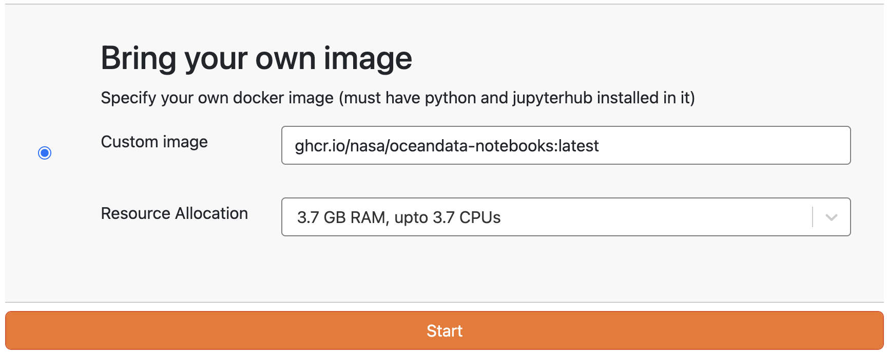

# Orientation

```{admonition} Let's Get Started
:class: note
- View slides {{ l1 }}
- Download nodebooks {{ d1 }}
- Watch recording {{ v1 }}
```

| Title | Slides | Recording |
| :---- | :----: | :-------: |
| Welcome, Introductions, and Housekeeping | [{{ l1 }}][hi-l] |                  |
| Orientation to CryoCloud                 | [{{ l1 }}][cc-l] | [{{ v1 }}][cc-v] |
| Group Projects                           | [{{ l1 }}][gp-l] |                  |

```{admonition} Server Options
:class: warning

When you get to the "Server Options" page after logging in at {{ jupyterhub_url }},
scroll down to the "Bring your own image" option and enter `ghcr.io/nasa/oceandata-notebooks:latest` into the "Custom image" field.



```

[hi-l]: https://docs.google.com/presentation/d/1BZ1t-3GsQ8d6ZeMfittVVJcwt4CPEUOAIeQgCfQTWcs/present

[cc-l]: https://docs.google.com/presentation/d/1GX_Sq3eubuoJVlpz2g4R3qvhCjiWZq6NAuwJU5Yd5mk/present
[cc-v]: https://youtu.be/ISlU24CBNRs

[gp-l]: https://docs.google.com/presentation/d/1cyGaWCFgtsUjcKRfZhx1RTiwA367pAXy/present
